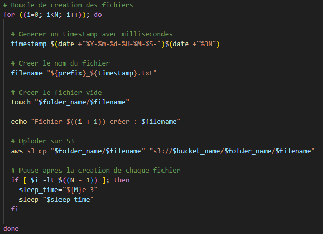

# TP Linux/ Shell


L'objectif de ce TP est de créer des scripts Shell pour automatiser la **création**, la **réorganisation** et le **transfert vers AWS S3** de fichiers, en respectant une structure temporelle et arborescence précise.

### Les scripts

- **creation_script.sh** : crée un répertoire avec N fichiers, chaque M millisecondes.
- **reorganization_script.sh** : réorganise les fichiers en arborescence temporelle.
- **main.sh** : script d’orchestration : exécute les 2 scripts ci-dessus dans l’ordre.


### Travail demandé

 1- **Création de fichiers**: Développer un script Shell pour automatiser la création d’un répertoire, puis générer N fichiers toutes les M millisecondes, en les nommant avec un préfixe suivi d’un timestamp: "prefix_year-month-day-hour-minute-second-millisecond.txt".

 Exemple : 
 
 Créer 2 fichiers avec un intervale de 2 ms et un prefix "git" dans le repertoire "repo_devops" donne le résultat suivant:
 
 <pre> ``` repo_devops/ ├── git_2023-06-29-12-42-19-64.txt └── git_2023-06-29-12-45-01-34.txt ``` </pre>

 2- **Réorganisation du repertoire** : Développer un script Shell qui se base sur le repertoire et les fichiers créer par le premier script puis les réorganisent en suivant une oborescence temporelle.

 Exemple : 
 
 La réorganisation de ces 2 fichiers:  `git_2023-06-29-12-42-19-64.txt ` et  `git_2023-06-29-12-45-01-34.txt ` donne cette arborescence:

 


### Contributions

**creation_script.sh**

Pour lancer le script il faut éxécuter la commande suivant : ```./creation_script.sh repo_devops git 2 2```

1- Vérification des paramètres  d'entrées de la commande:

 

 Sinon ça retourne un message :

 

 2- Récuperation des paramètres dans le script :

 

 3- Création du repertoire :

 

  4- Création des fichiers :

  Une boucle for permet de créer les fichiers un par un avec un intervale de 2ms via la fonction "sleep_time"
 

 5- Chargement sur AWS S3 (bonus):

 Le répertoire et les fichiers crées sont chargées directement sur une bucket S3

 

 

